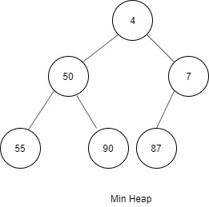
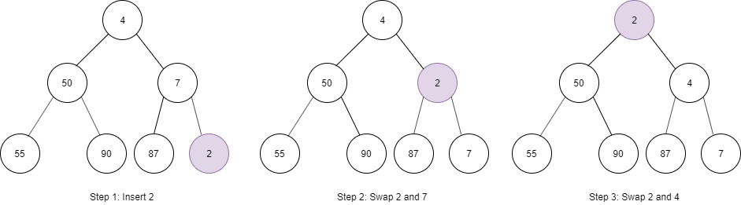
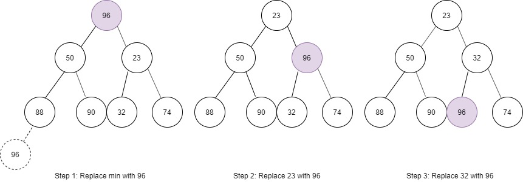

# Binary Heaps (Min-Heaps and Max-Heaps)
We'll just discuss min-heaps here. Max-heaps are essentially equivalent, but the elements are in descending order rather than ascending order.

A min-heap is a complete binary tree (that is, totally filled other than the rightmost elements on the last level) where each node is smaller than its children. The root, therefore, is the minimum element in the tree.

We have two key operations on a min-heap:*insert* and *extract_min*.

## Insert
When we insert into a min-heap, we always start by inserting the elements at the bottom. We insert at the right most sport so as to maintain the complete tree property.

Then we "fix" the tree by swapping the new element with its parent, until we find an appropriate spot for the element. We essentially bubble up the minimum element.

This takes O(logN) time, where n is the number of nodes in the heap.

## Extract Minimum Element
Finding the minimum element of a min-heap is easy: it's aways at the top. The tricker part is how to remove it.

First, we remove the element and swap it with the last element in the heap (the bottommost rightmost element). Then, we bubble down this element, swapping it with one of its children until the min heap property is restored.

Do we swap it with the left child or right child? That depends on their values. There's no inherent ordering between the left and right element, but you'll need to take the smaller one in order to maintain the min-heap ordering.

The algorithm will also take O(logN) time.