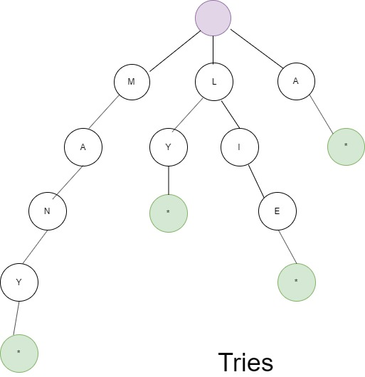

# Tries (Prefix Trees)

A tries (sometimes called a prefix tree) is a data structure. It comes up a lot in interview questions, but algorithm textbooks don't spend much time on this data structure.

A trie is a variant of an n-ary tree in which characters are stored at each node. Each path down the tree may represent a word.

The * nodes (sometimes called "null nodes") are often used to indicate complete words. For example, the fact that there is a * node under MANY indicates that MANY is a complete word. The existence of the MA path indicates there are words that start with MA.

