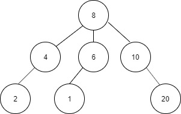
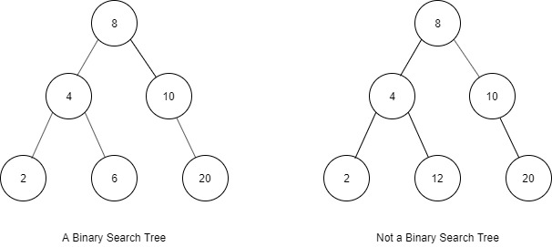
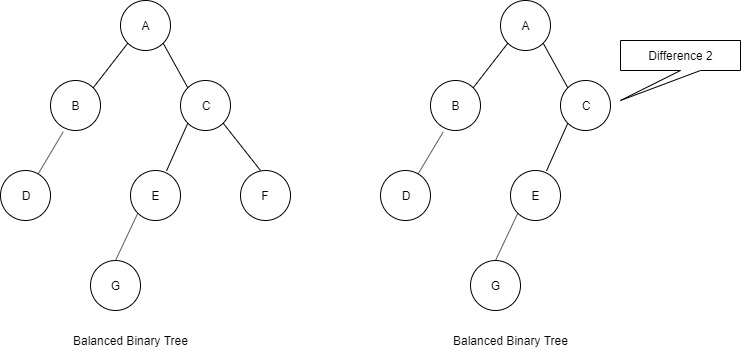

# Types of Trees

A tree is a data structure composed of nodes:
- Each tree has a root node.
- The root node has zero or more child nodes.
- Each child node has zero and more child nodes, and so on.

The tree cannot contain cycles. The nodes may or may not be in a particular order, they could have any data type as values, and they may or may not have links back to their parent node.

A very simple class definition for Node:
```java
class Node {
    public String name;
    public Node[] children;
}
```

## Binary Tree
A binary tree is a tree in which each node has **up to** two children. Not all trees are binary trees. For example, this tree is not a binary tree.



## Binary Search Tree (BST)
A binary search tree is a binary tree in which every node fits a specific ordering property: *all left descendents <= n < all right descendents*. This must be true for each node n.

>The definition of a binary search tree can vary slightly with respect to equality under some definitions, the tree cannot have duplicate values. In others, the duplicate values will be on the right or can be on either side. All are valid definitions, but you should clarify this with your interviewer.

Note that this inequality must be true for all of a node's descendents, not just its immediate children. The following tree on the left is a binary search tree. The tree on the right is not, since 12 is to the left of 8.



A binary search tree imposes the condition that, for each node, its left descendents are less than or equal to the current node, which is less than the right descendents.

## Balanced Binary Tree
A tree is balanced only if:
- the left and right subtrees' height differ by at most one, AND
- the left subtree is balanced, AND
- the right subtree is balanced



Two common types of balanced trees are red-black trees and AVL trees.